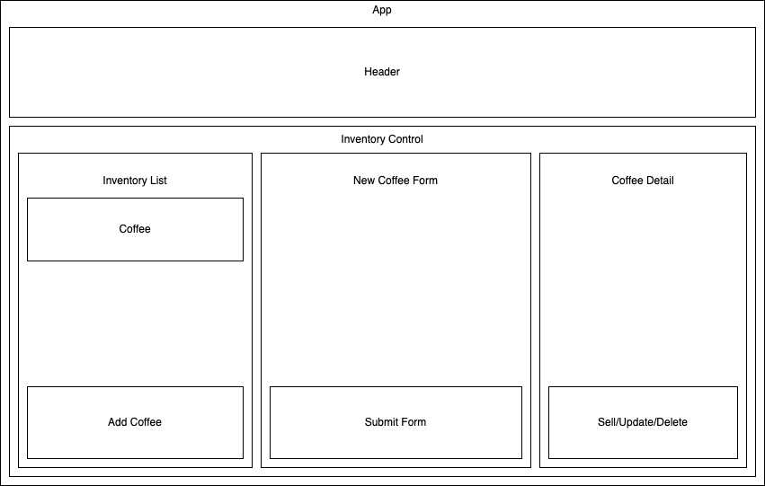

# Cooper's Coffee Shop

#### By _**(Ben Goodrow)**_

#### _{This is a simple RPG game.}_

## Technologies Used

* React
* Babel
* Bootstrap
* clean-webpack-plugin
* CSS
* css-loader
* enlist
* file-loader
* html-loader
* html-webpack-plugin
* JavaScript
* Jest
* jQuery
* Node Package Manger
* popper
* style-loader
* webpack-cli
* webpack-dev_server
* dotenv-webpack

## Description
_{A simple single page react application. Allows a user to create a type of coffee then sell that coffee by the pound.}_

## Setup/Installation Requirements

* Clone this repository to your desktop
* in terminal console git clone https://github.com/bpgoodrow/Coffee-Shop.git
* Navigate to the top level of the directory
* in terminal console cd coffee-shop
* Recreate the project and installation of dependencies require to be download.
* in terminal console npm install
* Create production environment.
* in terminal console npm run build
* Open project in development server in the browser.
* in terminal console npm run start

## Known Bugs

* _After navigating back to Main Coffee list the quantity resets back to original number_

## License

MIT

Copyright <2022> <Benjamin Goodrow>

Permission is hereby granted, free of charge, to any person obtaining a copy of this software and associated documentation files (the "Software"), to deal in the Software without restriction, including without limitation the rights to use, copy, modify, merge, publish, distribute, sublicense, and/or sell copies of the Software, and to permit persons to whom the Software is furnished to do so, subject to the following conditions:

The above copyright notice and this permission notice shall be included in all copies or substantial portions of the Software.

THE SOFTWARE IS PROVIDED "AS IS", WITHOUT WARRANTY OF ANY KIND, EXPRESS OR IMPLIED, INCLUDING BUT NOT LIMITED TO THE WARRANTIES OF MERCHANTABILITY, FITNESS FOR A PARTICULAR PURPOSE AND NONINFRINGEMENT. IN NO EVENT SHALL THE AUTHORS OR COPYRIGHT HOLDERS BE LIABLE FOR ANY CLAIM, DAMAGES OR OTHER LIABILITY, WHETHER IN AN ACTION OF CONTRACT, TORT OR OTHERWISE, ARISING FROM, OUT OF OR IN CONNECTION WITH THE SOFTWARE OR THE USE OR OTHER DEALINGS IN THE SOFTWARE.
